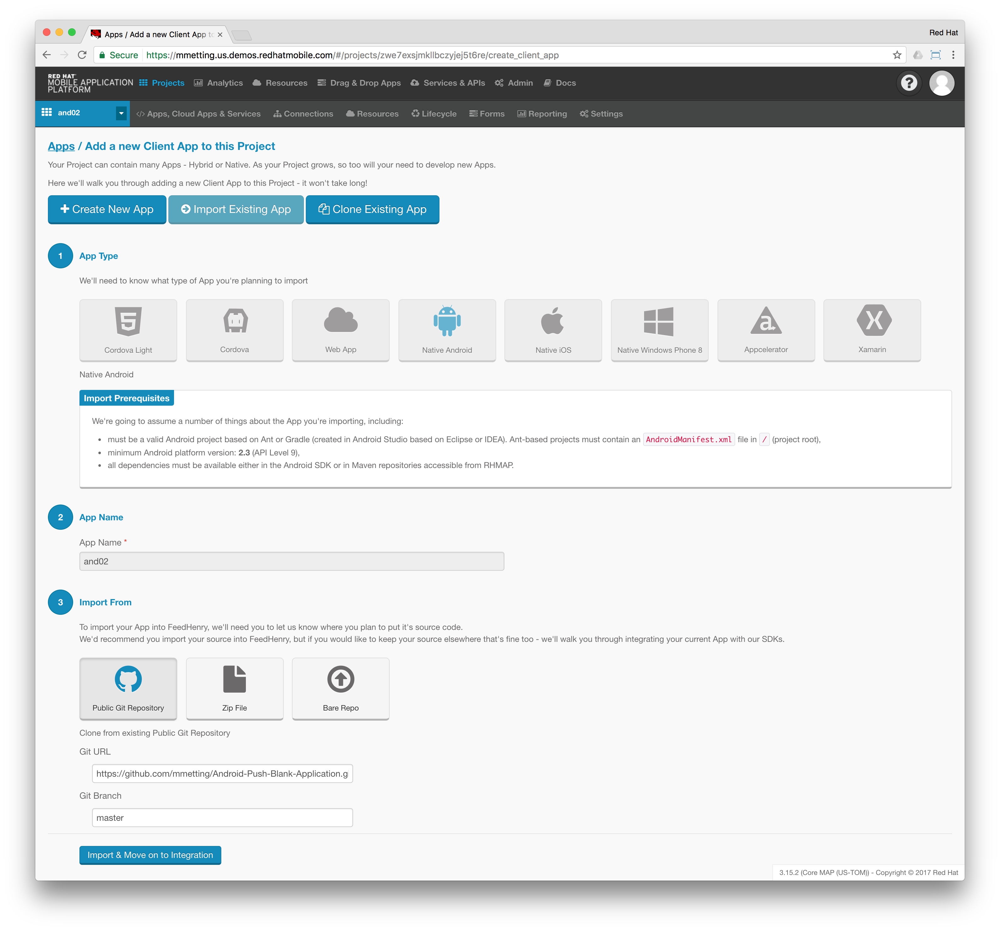

# Android-Push-Blank-Application
This is a simple HelloWorld application, receiving a FCM push notification token (Instance ID) from Google.

The token can be shared outside the app by clicking the share button.

In order to register / receive push notifications utilising the AeroGear UnifiedPush Server (UPS), the following actions have to be performed:

> Assuming AeroGear UPS has already been setup, a Variant ID, Variant Secret and Firebase Server Key exists!

## Option 1: Integrate AeroGear SDKs
Integrate the AeroGear SDKs to register for Push Notifications utilising the received FCM Instance ID.

## Option 2: Use the AeroGear UPS Rest interface

### Register device with AeroGear UPS

```
curl -u "<VARIANT_ID>:<VARIANT_SECRET>"  \
  -v -H "Accept: application/json" -H "Content-type: application/json"  \
  -d "{
     \"deviceToken\" : \"<DEVICE_TOKEN>\",
     \"alias\" : \"mmetting@redhat.com\",
     \"categories\" : [\"hello\", \"<VARIANT_ID>\"]
  }" \
  -X POST \
  https://<HOST>/api/v2/ag-push/rest/registry/device
```

### Subscribe device to FCM Topic

```
curl -k \
  -v -H "Accept: application/json" \
  -H "Authorization: key=<FIREBASE_SERVER_KEY>" \
  -H "Content-type: application/json" \
  -H "Content-Length: 0" \
  -X POST \
  https://iid.googleapis.com/iid/v1/<DEVICE_TOKEN>/rel/topics/<VARIANT_ID_OR_CATEGORY>

```

### Check FCM topic subscription

```
curl \
  -H "Authorization:key=<FIREBASE_SERVER_KEY>" \
  -X GET \
  "https://iid.googleapis.com/iid/info/<DEVICE_TOKEN>?details=true"

```  

## Import to Red Hat Mobile Application Platform

- Click the little plus sign in the apps' section
- Select `Import Existing App`
- Choose `Native Android`

- Click `Next`
- Give the app a name: `and02`
- Click `Next`
- Select `Public Git Repository`
- Insert the following Git Repo URL: `https://github.com/mmetting/Android-Push-Blank-Application.git`
- Make sure, `master` is specified



- Click the button for `Import & Move on to Integration`
- Click `Finished - Take me My App`
